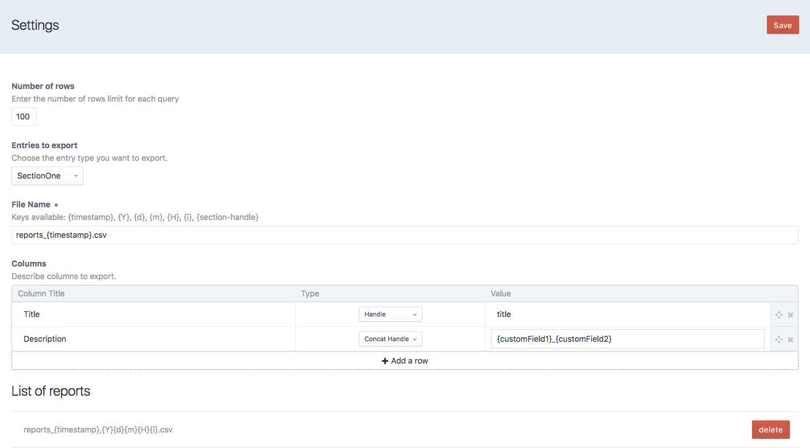
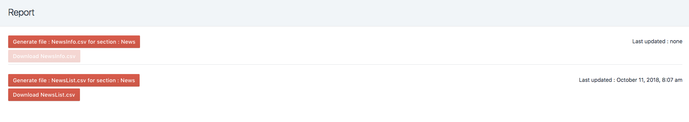

# craft-export-csv plugin for Craft CMS 3.x

## Requirements

This plugin requires Craft CMS 3.0.0-beta.23 or later.

## Installation

To install the plugin, follow these instructions.

1. In the Control Panel, go to Settings → Plugins and click the “Install” button for craft-export-csv.

## Overview

This plugin will allow the settings of multiple csv export configuration

## Configuration

When saving a setting you can select a section and enter the name of the file you want to save locally. Then you can add field to be generated in the csv. There are currently two types of rows that you can create ( one field or multiple field and texts).

You can also set the size of rows each job will have to process. Most server will not allowed a large amount. This depends on your php configuration.

## Using craft-export-csv

When using export csv, on the main page you can generate a csv file. Then you can download the last version of the file generated. Generating a new file will overwrite the previous csv file.

## Roadmap

Some ideas for potential features:

* Modifiy existing exports settings
* UI more dynamic

Brought to you by [KFFEIN](http://kffein.com)
